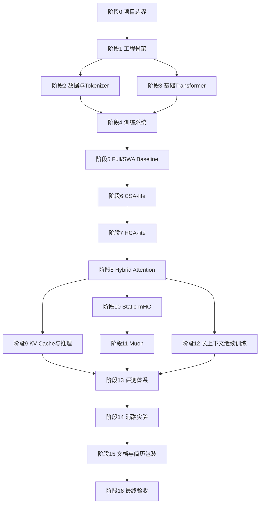

# LongContext-V4-Lab 项目任务书

> 项目名称：**DeepSeek-V4 Inspired Long-Context LM：基于 CSA/HCA 混合压缩注意力的长上下文语言模型训练与评测项目**  
> Python 版本：**3.12**  

> 三次优化说明：本版进一步补充了 HCA local window gather 实现、CSA `beta_raw` 参数分组、CSA/HCA `W_z` 参数归属、长上下文继续训练验证集对应关系、`main_350m_hybrid` 150M checkpoint 复用规则，以及 Debug Model 的 smoke test 边界。

> 主模型规模：**约 350M 参数**  
> 最终主线：**350M Decoder-only LM + CSA-lite + HCA-lite + Hybrid Attention + Static-mHC + Muon + 1B seen tokens + 16K 继续训练 + 32K 长上下文评测**

---

## 0. 项目定位与边界

### 0.1 项目目标

本项目实现一个中等规模 Decoder-only 长上下文语言模型训练框架，参考 DeepSeek-V4 中 CSA、HCA、mHC、Muon 以及长文档数据构造思路，在单卡 RTX 5090 / 32 GB 上完成模型训练、长上下文继续训练、性能评测和消融实验。

最终项目必须包含：

1. 一个从零实现的 Decoder-only Transformer LM。
2. 一个 120M 级 Debug Model，用于验证训练链路。
3. 一个 350M 级 Main Model，作为简历主模型。
4. Full Attention、Sliding Window Attention、CSA-lite、HCA-lite、Hybrid Attention 五类注意力实现。
5. Static-mHC 残差增强模块。
6. Muon + AdamW 参数分组优化器。
7. 4K、8K、16K、32K 长上下文训练与评测流程。
8. PPL、tokens/s、显存、KV cache、Passkey Retrieval、Needle-in-a-Haystack 评测。
9. 完整消融报告和简历项目描述。

### 0.2 项目不实现的内容

本项目明确不实现：

1. 不实现 DeepSeek-V4 级别 MoE 大模型训练。
2. 不实现 FP4 Quantization-Aware Training。
3. 不实现 TileLang 自定义 kernel。
4. 不实现多机多卡 Expert Parallelism。
5. 不实现 GRPO、OPD、完整后训练专家合并流程。
6. 不实现百万 token 上下文训练。
7. 不实现 MTP Loss。
8. 不实现完整动态 mHC，只实现 Static-mHC。

README 中必须单独说明“论文原始能力与单卡复现边界”，避免将本项目表述成完整复现 DeepSeek-V4。

---

## 1. 工程骨架与环境规范

### 1.1 项目目录

项目目录固定为：

```text
longcontext-v4-lab/
├── pyproject.toml
├── README.md
├── configs/
│   ├── data_sources.yaml
│   ├── debug_120m_full.yaml
│   ├── main_350m_full.yaml
│   ├── main_350m_swa.yaml
│   ├── main_350m_csa.yaml
│   ├── main_350m_hca.yaml
│   ├── main_350m_hybrid.yaml
│   └── main_350m_hybrid_mhc_muon.yaml
├── data/
│   ├── prepare_corpus.py
│   ├── train_tokenizer.py
│   ├── tokenize_corpus.py
│   ├── pack_dataset.py
│   └── dataset.py
├── longcontext/
│   ├── model/
│   │   ├── config.py
│   │   ├── transformer.py
│   │   ├── block.py
│   │   ├── rmsnorm.py
│   │   ├── rope.py
│   │   ├── ffn.py
│   │   ├── attention_full.py
│   │   ├── attention_swa.py
│   │   ├── attention_csa.py
│   │   ├── attention_hca.py
│   │   ├── attention_hybrid.py
│   │   ├── mhc.py
│   │   └── kv_cache.py
│   ├── optim/
│   │   ├── muon.py
│   │   └── build_optimizer.py
│   ├── train/
│   │   ├── pretrain.py
│   │   ├── trainer.py
│   │   ├── scheduler.py
│   │   └── checkpoint.py
│   ├── eval/
│   │   ├── eval_ppl.py
│   │   ├── eval_passkey.py
│   │   ├── eval_needle.py
│   │   ├── eval_speed.py
│   │   └── eval_kv_cache.py
│   └── utils/
│       ├── seed.py
│       ├── logging.py
│       └── profiler.py
├── scripts/
│   ├── run_debug.sh
│   ├── run_main_full.sh
│   ├── run_main_hybrid.sh
│   ├── eval_all.sh
│   └── profile_all.sh
├── outputs/
│   ├── active/
│   │   └── state_latest.pt
│   ├── artifacts/
│   └── logs/
└── reports/
    ├── design.md
    ├── experiment_log.md
    ├── ablation.md
    ├── memory_profile.md
    └── resume_summary.md
```

### 1.2 Python 与依赖管理

必须使用 `uv` 管理 Python 环境，Python 版本固定为 **3.12**。

```bash
uv init longcontext-v4-lab --python 3.12
cd longcontext-v4-lab

uv add torch transformers datasets tokenizers safetensors numpy tqdm pyyaml einops matplotlib pandas
uv add --dev pytest ruff mypy
```

`pyproject.toml` 必须包含：

```toml
[project]
requires-python = ">=3.12,<3.13"

[tool.ruff]
line-length = 100

[tool.mypy]
python_version = "3.12"
ignore_missing_imports = true
```

### 1.3 工程验收标准

阶段完成后必须满足：

1. `uv run python -m pytest` 能正常执行。
2. 所有源码文件可以被 `ruff` 检查。
3. 所有训练脚本统一从 `configs/*.yaml` 读取参数。
4. README 写清楚项目目标、硬件资源、论文参考点、复现边界。

---

## 2. 数据集、Tokenizer 与样本打包

### 2.1 数据集固定方案

本项目不使用 DeepSeek-V4 私有数据集，而是使用公开数据构造一个 **DeepSeek-V4-style corpus**。

固定使用以下公开数据集：

| 数据类别 | 数据集 | 用途 | 主训练 token 配比 |
|---|---|---|---:|
| 通用文本 / Web | `HuggingFaceFW/fineweb-edu`，`sample-10BT` | 基础语言建模能力 | 40% |
| 代码文本 | `bigcode/starcoderdata` 的固定语言白名单子集 | 代码、结构化文本、FIM 相关能力 | 25% |
| 数学文本 | `EleutherAI/proof-pile-2`，`open-web-math` 子集 | 数学表达、推理文本 | 15% |
| 长文档 | `EleutherAI/proof-pile-2`，`arxiv` 子集 | 长上下文继续训练与长文档建模 | 20% |

### 2.2 训练数据规模

最终项目训练规模固定为：

```text
主训练总量：1B seen tokens
长上下文继续训练：200M seen tokens
结构消融总量：约 1.05B seen tokens
项目总训练量：约 2.15B seen tokens
```

主训练 `main_350m_hybrid` 的 1B seen tokens 按比例拆分为：

| 类别 | 数据集 | Seen tokens |
|---|---|---:|
| 通用文本 | FineWeb-Edu sample-10BT | 400M |
| 代码文本 | StarCoderData 语言白名单子集 | 250M |
| 数学文本 | Proof-Pile-2 open-web-math | 150M |
| 长文档 | Proof-Pile-2 arxiv | 200M |
| 合计 |  | 1B |

长上下文继续训练 200M seen tokens 固定为：

| 类别 | 数据集 | Seen tokens |
|---|---|---:|
| 长文档 | Proof-Pile-2 arxiv | 100M |
| 代码文本 | StarCoderData 语言白名单子集 | 60M |
| 数学文本 | Proof-Pile-2 open-web-math | 40M |
| 合计 |  | 200M |

### 2.3 数据加载方式

由于数据盘只有 50GB，不允许完整下载大数据集。实现方式固定为：

1. 使用 streaming 方式读取原始数据。
2. 清洗后直接送入 tokenizer。
3. 本地只保存 tokenized shard。
4. tokenized shard 总大小控制在 28GB 以内。
5. checkpoint 与模型权重产物总大小控制在 13GB 以内。

数据目录固定为：

```text
data/
├── tokenizer/
│   └── tokenizer.json
├── shards/
│   ├── train_web_*.bin
│   ├── train_code_*.bin
│   ├── train_math_*.bin
│   ├── train_longdoc_*.bin
│   ├── val_pretrain.bin
│   └── val_long.bin
└── metadata/
    ├── corpus_stats.json
    ├── source_mix.json
    ├── tokenizer_stats.json
    ├── filter_stats.json
    ├── rejected_samples.jsonl
    ├── val_pretrain_stats.json
    ├── val_long_stats.json
    ├── val_doc_hashes.txt
    ├── split_stats.json
    └── code_language_stats.json
```

### 2.4 Tokenizer 规定

必须训练一个项目内 tokenizer，而不是完全依赖外部大模型 tokenizer。

Tokenizer 规格固定为：

```text
类型：BPE tokenizer
vocab_size：32000
special tokens：
  <|pad|>
  <|bos|>
  <|eos|>
  <|fim_prefix|>
  <|fim_middle|>
  <|fim_suffix|>
  <|doc_sep|>
```

需要实现：

1. `train_tokenizer.py`：训练 tokenizer。
2. `tokenize_corpus.py`：将文本转为 token ids。
3. `pack_dataset.py`：将 token ids 打包为固定长度训练样本。
4. `dataset.py`：实现 mmap 读取，避免一次性加载所有数据。

### 2.5 `prepare_corpus.py` 数据清洗与过滤标准

#### 2.5.1 原始文本标准化规则

`prepare_corpus.py` 对所有数据统一执行：

1. 将 Windows 换行符 `\r\n` 统一为 `\n`。
2. 删除 NULL 字符。
3. 删除不可见控制字符，但保留 `\n` 和 `\t`。
4. 去除文本首尾空白。
5. 连续 3 个以上空行压缩为 2 个空行。
6. 对文本计算 `sha1` 作为 `doc_hash`。
7. `doc_hash` 重复的文档直接丢弃。

`doc_hash` 固定为：

```text
sha1(source + "\n" + normalized_text)
```

#### 2.5.2 各来源过滤阈值

固定过滤标准如下：

| 来源 | 最小字符数 | 最小 token 数 | 最小非空行数 | 最大保留 token 数 |
|---|---:|---:|---:|---:|
| web | 300 chars | 128 tokens | 3 行 | 8192 |
| code | 200 chars | 128 tokens | 5 行 | 8192 |
| math | 300 chars | 128 tokens | 3 行 | 8192 |
| long_doc | 2000 chars | 1024 tokens | 20 行 | 65536 |

超过最大 token 上限的文档不丢弃，而是截断到对应 token 上限。

#### 2.5.3 丢弃原因记录

`prepare_corpus.py` 必须记录每条被丢弃样本的原因，原因枚举固定为：

```text
empty_text
too_short_chars
too_short_tokens
too_few_lines
duplicate_doc
unsupported_language
missing_code_metadata
invalid_text
```

最终输出：

```text
data/metadata/filter_stats.json
data/metadata/rejected_samples.jsonl
```

`filter_stats.json` 固定包含：

```json
{
  "accepted_docs": 0,
  "rejected_docs": 0,
  "rejected_by_reason": {
    "empty_text": 0,
    "too_short_chars": 0,
    "too_short_tokens": 0,
    "too_few_lines": 0,
    "duplicate_doc": 0,
    "unsupported_language": 0,
    "missing_code_metadata": 0,
    "invalid_text": 0
  },
  "accepted_tokens_by_source": {
    "web": 0,
    "code": 0,
    "math": 0,
    "long_doc": 0
  }
}
```

### 2.6 StarCoderData 语言子集规定

StarCoderData 不能直接使用全量 `train split`，必须固定语言白名单和 token 配比。

#### 2.6.1 固定语言白名单

项目只使用以下 11 类代码语言：

```text
python
java
javascript
typescript
cpp
c
go
rust
sql
shell
kotlin
```

其他语言全部丢弃。

#### 2.6.2 语言识别规则

代码样本语言识别顺序固定为：

1. 优先使用数据集 metadata 中的 `language` 字段。
2. 如果 `language` 字段缺失，则根据文件扩展名推断。
3. 如果 `language` 和文件扩展名都无法识别，则丢弃，`reason = missing_code_metadata`。
4. 如果语言不在白名单中，则丢弃，`reason = unsupported_language`。

扩展名映射固定为：

| 语言 | 扩展名 |
|---|---|
| python | `.py` |
| java | `.java` |
| javascript | `.js`, `.jsx` |
| typescript | `.ts`, `.tsx` |
| cpp | `.cpp`, `.cc`, `.cxx`, `.hpp`, `.hh`, `.hxx` |
| c | `.c`, `.h` |
| go | `.go` |
| rust | `.rs` |
| sql | `.sql` |
| shell | `.sh`, `.bash`, `.zsh` |
| kotlin | `.kt`, `.kts` |

#### 2.6.3 代码语料 token 配比

主训练中 code 总量固定为 250M tokens，各语言配比如下：

| 语言 | 比例 | 主训练 tokens |
|---|---:|---:|
| python | 22% | 55M |
| java | 18% | 45M |
| javascript | 10% | 25M |
| typescript | 8% | 20M |
| cpp | 10% | 25M |
| c | 6% | 15M |
| go | 7% | 17.5M |
| rust | 5% | 12.5M |
| sql | 6% | 15M |
| shell | 5% | 12.5M |
| kotlin | 3% | 7.5M |
| 合计 | 100% | 250M |

长上下文继续训练中 code 总量固定为 60M tokens，各语言按同一比例缩放：

| 语言 | 长上下文继续训练 tokens |
|---|---:|
| python | 13.2M |
| java | 10.8M |
| javascript | 6.0M |
| typescript | 4.8M |
| cpp | 6.0M |
| c | 3.6M |
| go | 4.2M |
| rust | 3.0M |
| sql | 3.6M |
| shell | 3.0M |
| kotlin | 1.8M |
| 合计 | 60M |

`val_pretrain` 中 code validation 总量固定为 5M tokens，同样按上述语言比例抽取。

#### 2.6.4 代码数据额外过滤规则

StarCoderData 样本除通用过滤规则外，还必须满足：

1. 最小字符数：200。
2. 最小 token 数：128。
3. 非空代码行数不少于 5 行。
4. 最大保留 token 数：8192。
5. 不允许二进制内容。
6. 不允许不可见控制字符比例超过 2%。
7. 不允许单行平均长度超过 300 字符。

#### 2.6.5 代码数据输出统计

必须输出：

```text
data/metadata/code_language_stats.json
```

格式固定为：

```json
{
  "target_tokens": {
    "python": 55000000,
    "java": 45000000,
    "javascript": 25000000,
    "typescript": 20000000,
    "cpp": 25000000,
    "c": 15000000,
    "go": 17500000,
    "rust": 12500000,
    "sql": 15000000,
    "shell": 12500000,
    "kotlin": 7500000
  },
  "actual_tokens": {
    "python": 0,
    "java": 0,
    "javascript": 0,
    "typescript": 0,
    "cpp": 0,
    "c": 0,
    "go": 0,
    "rust": 0,
    "sql": 0,
    "shell": 0,
    "kotlin": 0
  },
  "accepted_docs": {},
  "rejected_docs": {},
  "language_whitelist": [
    "python",
    "java",
    "javascript",
    "typescript",
    "cpp",
    "c",
    "go",
    "rust",
    "sql",
    "shell",
    "kotlin"
  ]
}
```

### 2.7 Validation Set 构建方式

Validation set 不从训练 shard 中随机切，而是在**文档级别先切分，再 tokenize，再 pack**。这样可以避免同一文档的一部分进入训练集、另一部分进入验证集。

#### 2.7.1 Validation 集固定规模

项目固定构建两个验证集：

```text
val_pretrain：20M tokens
val_long：8M tokens
```

#### 2.7.2 `val_pretrain` 来源比例

`val_pretrain` 用于主训练阶段验证，来源比例与预训练数据一致：

| 来源 | 数据集 | Validation tokens |
|---|---|---:|
| web | FineWeb-Edu sample-10BT | 8M |
| code | StarCoderData 语言白名单子集 | 5M |
| math | Proof-Pile-2 open-web-math | 3M |
| long_doc | Proof-Pile-2 arxiv | 4M |
| 合计 |  | 20M |

#### 2.7.3 `val_long` 来源比例

`val_long` 用于长上下文继续训练验证，只使用 long-context mix：

| 来源 | 数据集 | Validation tokens |
|---|---|---:|
| long_doc | Proof-Pile-2 arxiv | 4M |
| code | StarCoderData 语言白名单子集 | 2.4M |
| math | Proof-Pile-2 open-web-math | 1.6M |
| 合计 |  | 8M |

#### 2.7.4 文档级切分规则

所有数据在进入训练集前，先计算：

```text
doc_hash = sha1(source + "\n" + normalized_text)
```

然后使用固定随机种子：

```text
split_seed = 20260514
```

切分逻辑固定为：

1. 对每条文档计算 `doc_hash`。
2. 如果该来源的 validation token quota 尚未填满，则根据 hash 顺序进入 validation candidate。
3. validation quota 满后，后续合格文档进入 train candidate。
4. 所有进入 validation 的 `doc_hash` 必须写入 `val_doc_hashes.txt`。
5. train 构建时如果 `doc_hash` 出现在 `val_doc_hashes.txt` 中，必须跳过。
6. 如果某个来源的 validation quota 无法填满，脚本必须报错终止，不允许从训练集回填。

### 2.7.5 Validation pack seq_len 规定

Validation set 先保存为 token stream，再按评测长度生成 packed validation cache。

固定文件为：

```text
data/shards/
├── val_pretrain_tokens.bin
├── val_long_tokens.bin
├── val_pretrain_seq1024.bin
├── val_pretrain_seq4096.bin
├── val_long_seq8192.bin
└── val_long_seq16384.bin
```

`val_pretrain` 用于普通预训练阶段验证，固定 pack 两种长度：

```text
val_pretrain_seq1024.bin
val_pretrain_seq4096.bin
```

对应：

```text
seq_len = 1024
seq_len = 4096
```

`val_long` 用于长上下文继续训练验证，固定 pack 两种长度：

```text
val_long_seq8192.bin
val_long_seq16384.bin
```

对应：

```text
seq_len = 8192
seq_len = 16384
```

`eval_ppl.py` 固定使用：

| 评测长度 | 使用文件 |
|---:|---|
| 1024 | `val_pretrain_seq1024.bin` |
| 4096 | `val_pretrain_seq4096.bin` |
| 8192 | `val_long_seq8192.bin` |
| 16384 | `val_long_seq16384.bin` |

每个 packed 样本长度固定为：

```text
seq_len + 1
```

输入和标签仍然是：

```text
input_ids = tokens[:-1]
labels    = tokens[1:]
```

如果磁盘压力过大，`val_*_tokens.bin` 是主文件，`val_*_seq*.bin` 可以由脚本重复生成；但项目验收时必须至少能生成上述四个 packed validation 文件。


### 2.8 样本打包规定

训练样本必须按 document-aware packing 实现：

1. 同一文档优先连续打包。
2. 不同文档之间插入 `<|doc_sep|>`。
3. 每个训练样本长度固定为 `seq_len + 1`。
4. 输入为 `tokens[:-1]`。
5. 标签为 `tokens[1:]`。
6. loss 对 `<|pad|>` 位置屏蔽。

---

## 3. 模型结构与损失函数

### 3.1 基础 Decoder-only Transformer

基础模型必须实现：

1. Token Embedding。
2. RMSNorm。
3. RoPE。
4. Causal Self-Attention。
5. SwiGLU FFN。
6. Pre-Norm Transformer Block。
7. LM Head。
8. Cross Entropy LM Loss。

基础 Transformer Block 固定为：

```text
x = x + Attention(RMSNorm(x))
x = x + FFN(RMSNorm(x))
```

### 3.2 Debug Model 规格

Debug Model 配置固定为：

```yaml
model:
  name: debug_120m
  vocab_size: 32000
  n_layers: 12
  d_model: 768
  n_heads: 12
  d_head: 64
  d_ff: 2048
  max_seq_len: 1024
  rope_base: 10000
  attention_type: full
```


### 3.2.1 Debug Model 评测规定

`debug_120m_full` 不参加正式结构消融，不进入 `reports/ablation.md` 的主结果表。Debug Model 只用于工程链路验证，必须完成以下 smoke test：

```text
1. forward shape test
2. backward test
3. optimizer.step test
4. checkpoint save/load test
5. eval_ppl.py on val_pretrain_seq1024.bin
6. generate 32 tokens greedy decoding test
7. peak memory logging test
```

Debug Model 训练规模固定为：

```text
debug_120m_full: 50M seen tokens
seq_len = 1024
```

Debug Model 必须交付：

```text
outputs/artifacts/debug_120m_full/weights_final.safetensors
outputs/artifacts/debug_120m_full/config.yaml
outputs/artifacts/debug_120m_full/metrics.json
```

`metrics.json` 至少包含：

```json
{
  "model": "debug_120m_full",
  "seen_tokens": 50000000,
  "seq_len": 1024,
  "val_loss_seq1024": 0,
  "ppl_seq1024": 0,
  "train_tokens_per_second": 0,
  "peak_memory_mb": 0,
  "checkpoint_reload_success": true,
  "generation_smoke_test_success": true
}
```

Debug Model 不强制评测：

```text
Passkey
Needle
8K/16K/32K speed
KV cache comparison
正式消融对比
```

### 3.3 Main Model 规格

Main Model 配置固定为：

```yaml
model:
  name: main_350m
  vocab_size: 32000
  n_layers: 24
  d_model: 1024
  n_heads: 16
  d_head: 64
  d_ff: 2816
  max_seq_len: 4096
  rope_base: 10000
  attention_type: full
```

### 3.4 损失函数规定

本项目所有预训练模型统一使用 **Next Token Prediction Cross Entropy** 作为主损失函数。

对于输入序列：

$$
x = (x_1, x_2, \ldots, x_T)
$$

训练时构造：

```text
input_ids = tokens[:-1]
labels    = tokens[1:]
```

模型在位置 $t$ 输出对下一个 token 的预测：

$$
p_\theta(x_{t+1} \mid x_{\leq t})
$$

损失函数为：

$$
\mathcal{L}_{LM}
=
-\frac{
\sum_{t=1}^{T-1} m_t \log p_\theta(x_{t+1} \mid x_{\leq t})
}{
\sum_{t=1}^{T-1} m_t
}
$$

其中 $m_t$ 表示该位置是否参与 loss 计算。所有 padding token 对应位置不参与 loss。

本项目不实现：

1. MTP Loss。
2. MoE balance loss。
3. RL loss。
4. Distillation loss。

Full Attention、SWA、CSA、HCA、Hybrid、Hybrid+mHC、Hybrid+mHC+Muon 均使用相同的 LM Loss，以保证消融实验公平性。

CSA-lite 中 indexer 不设置独立监督损失，但 indexer score 必须作为 selected compressed attention 的 bias 参与 attention logits 计算，使 indexer 能够通过 LM Loss 端到端训练。

### 3.5 模型代码验收标准

模型代码必须满足：

1. 输入 `input_ids: [B, T]`，输出 `logits: [B, T, vocab_size]`。
2. 支持 `labels` 输入并返回 loss。
3. 支持 attention mask。
4. 支持 RoPE。
5. 支持 bf16/fp16 自动混合精度。
6. 支持 gradient checkpointing。
7. 能打印模型参数量。
8. 能在随机数据上完成 forward、backward、optimizer.step。

---

## 4. RoPE 与 RoPE Scaling

### 4.1 RoPE 基础规定

RoPE 只作用于 Q 和 K，不作用于 V。

Full/SWA/local branch 中：

```text
Q 使用 query token position。
K 使用 key token position。
```

### 4.2 Linear Position Scaling

本项目固定使用 **linear position scaling**，不修改 `rope_base`，不修改 frequency，不使用 NTK scaling。

配置固定为：

```yaml
rope:
  base: 10000
  scaling_type: linear_position
  scaling_factor: 4.0
```

位置缩放公式为：

$$
p_{scaled} = \frac{p}{scaling\_factor}
$$

RoPE 角度为：

$$
\theta_{p,k}
=
\frac{p}{scaling\_factor}
\cdot
\frac{1}{base^{2k/d_{rope}}}
$$

实现固定为：

```python
def build_rope_freqs(
    seq_len: int,
    rope_dim: int,
    base: float = 10000.0,
    scaling_factor: float = 1.0,
    device: torch.device | None = None,
):
    positions = torch.arange(seq_len, device=device, dtype=torch.float32)
    positions = positions / scaling_factor

    inv_freq = 1.0 / (
        base ** (torch.arange(0, rope_dim, 2, device=device, dtype=torch.float32) / rope_dim)
    )

    freqs = torch.outer(positions, inv_freq)
    cos = freqs.cos()
    sin = freqs.sin()
    return cos, sin
```

### 4.3 Compressed Branch 的 RoPE 位置

CSA/HCA compressed branch 中：

1. 先压缩 K_raw 得到 K_comp。
2. 再对 K_comp 应用 RoPE。
3. compressed block 的代表位置为该 block 的最后一个 token 位置。

对于 block `g`：

$$
block\_pos(g) = (g + 1) \cdot block\_size - 1
$$

CSA 中：

```text
block_size = m = 4
block_pos(g) = (g + 1) * 4 - 1
```

HCA 中：

```text
block_size = m' = 64
block_pos(g) = (g + 1) * 64 - 1
```

基础 4K 训练时：

```text
scaling_factor = 1.0
```

长上下文继续训练和 16K/32K 评测时：

```text
scaling_factor = 4.0
```

---

## 5. 训练系统

### 5.1 Trainer 功能规定

训练系统必须实现：

1. config 加载。
2. seed 固定。
3. 模型构建。
4. 数据加载。
5. optimizer 构建。
6. learning rate scheduler。
7. mixed precision。
8. gradient accumulation。
9. gradient clipping。
10. checkpoint 保存与恢复。
11. validation loss 评估。
12. tokens/s 统计。
13. GPU peak memory 统计。
14. 训练日志写入 JSONL。

### 5.2 训练参数规定

Main Model 的基础训练参数固定为：

```yaml
train:
  seq_len: 4096
  micro_batch_size: 1
  grad_accum_steps: 32
  dtype: bf16
  learning_rate: 3.0e-4
  min_lr: 3.0e-5
  warmup_steps: 2000
  weight_decay: 0.1
  grad_clip: 1.0
  eval_interval_steps: 500
  save_interval_steps: 2000
  gradient_checkpointing: true
```

### 5.3 Checkpoint 保存策略

本项目将 checkpoint 分为两类：**完整训练状态**和**仅模型权重**。

#### 5.3.1 完整训练状态

完整训练状态只用于断点恢复，文件名固定为：

```text
outputs/active/state_latest.pt
```

该文件必须覆盖保存，任何时刻只允许存在一个完整训练状态文件。

完整训练状态包含：

1. model state_dict。
2. optimizer state_dict。
3. scheduler state_dict。
4. step。
5. seen_tokens。
6. best_val_loss。
7. config snapshot。
8. random states。

#### 5.3.2 仅模型权重

仅模型权重用于评测和实验归档，统一保存为：

```text
weights_*.safetensors
```

仅模型权重不保存 optimizer、scheduler 和 random states。

每个消融模型完成训练后，只保留：

```text
weights_final.safetensors
config.yaml
metrics.json
train_log.jsonl.gz
eval_log.jsonl
```

并删除完整训练状态文件。

主模型保存规则固定为：

```text
state_latest.pt：完整训练状态，覆盖保存。
weights_best_val.safetensors：验证集 loss 最低时覆盖保存。
weights_seen_150m.safetensors：训练到 150M seen tokens 时保存，仅权重。
weights_seen_500m.safetensors：训练到 500M seen tokens 时保存，仅权重。
weights_seen_1b.safetensors：训练到 1B seen tokens 时保存，仅权重。
```

本项目不保存 `milestone_2b.pt` 完整 checkpoint。

### 5.4 磁盘预算

固定磁盘预算如下：

| 项目 | 上限 |
|---|---:|
| 数据 shards | 28GB |
| 完整训练状态 | 5GB |
| 模型权重 artifacts | 8GB |
| 日志与评测结果 | 2GB |
| 临时文件缓冲 | 5GB |
| 合计 | 48GB |

消融实验模型一律只保留 `weights_final.safetensors`，不得保存 optimizer state。

---

## 6. Full Attention 与 Sliding Window Attention

### 6.1 Full Attention

Full Attention 必须实现标准 causal self-attention：

$$
Q = XW_q
$$

$$
K = XW_k
$$

$$
V = XW_v
$$

$$
A = \operatorname{softmax}\left(\frac{QK^T}{\sqrt{d_{head}}} + causal\_mask\right)
$$

$$
O = AV
$$

必须支持：

1. RoPE。
2. causal mask。
3. attention dropout 关闭。
4. bf16。
5. KV cache 推理。

### 6.2 Sliding Window Attention

Sliding Window Attention 固定窗口大小：

```yaml
attention:
  type: swa
  window_size: 512
```

每个 token 只能访问：

$$
j \in [\max(0, i - 512 + 1), i]
$$

---

## 7. CSA-lite 实现规定

### 7.1 CSA-lite 目标

CSA-lite 实现压缩稀疏注意力：

1. 将连续 `m` 个 token 的 K/V 压缩成一个 compressed KV entry。
2. 使用 indexer query 和 compressed indexer key 计算相关性。
3. 每个 query token 选择 top-k 个 compressed KV entries。
4. query 对 selected compressed KV entries 与 local window KV 组成的 memory 做一次 attention。
5. 通过 sliding window branch 保留局部细粒度依赖。

### 7.2 维度规定

CSA-lite 使用独立的 indexer projection 和 attention projection。`index_dim` 只用于 compressed block 检索，`d_head` 只用于实际 attention 计算，二者参数不共享。

模型维度固定为：

```text
D = d_model = 1024
H = n_heads = 16
Dh = d_head = 64
index_dim = 128
m = compression_block_size = 4
top_k = 128
local_window = 256
```

### 7.3 Projection 规定

CSA 中存在两类投影：

```text
Attention 投影：
W_q: D -> H × Dh
W_k: D -> H × Dh
W_v: D -> H × Dh
W_o: D -> D

Indexer 投影：
W_iq: D -> index_dim
W_ik: D -> index_dim
```

Indexer 只负责决定当前 query token 应该选择哪些 compressed blocks，不参与最终 token 表示维度计算。

### 7.4 K/V 压缩方式

CSA-lite 中，K 和 V 分开投影、分开压缩，但共享同一组 block 内压缩权重。

输入：

```text
X: [B, T, D]
```

先得到：

```text
Q     = W_q(X) -> [B, T, H, Dh]
K_raw = W_k(X) -> [B, T, H, Dh]
V_raw = W_v(X) -> [B, T, H, Dh]
Z     = W_z(X) -> [B, T, H, 1]
```

按 block reshape：

```text
K_raw -> [B, G, m, H, Dh]
V_raw -> [B, G, m, H, Dh]
Z     -> [B, G, m, H, 1]
```

其中：

```text
G = ceil(T / m)
m = 4
```

block 内压缩权重为：

$$
\alpha_{b,g,j,h}
=
\operatorname{softmax}_{j}
\left(
Z_{b,g,j,h}
\right)
$$

分别压缩 K 和 V：

$$
K^{comp}_{b,g,h}
=
\sum_{j=0}^{m-1}
\alpha_{b,g,j,h}
K^{raw}_{b,g,j,h}
$$

$$
V^{comp}_{b,g,h}
=
\sum_{j=0}^{m-1}
\alpha_{b,g,j,h}
V^{raw}_{b,g,j,h}
$$

输出为：

```text
K_comp: [B, G, H, Dh]
V_comp: [B, G, H, Dh]
```

因此：

```text
compressed KV entry = (K_comp, V_comp)
```

### 7.5 Indexer 与 top-k 规定

Indexer 不直接使用 `d_head=64` 的单头 K，也不和 attention K 共享维度。固定实现为：

1. 将 `K_comp` 多头展平回 D 维。
2. 再通过 `W_ik` 投影到 `index_dim`。

具体 shape：

```text
K_comp:      [B, G, H, Dh]
K_comp_flat: [B, G, H × Dh] = [B, G, D]

index_q = W_iq(X)           -> [B, T, index_dim]
index_k = W_ik(K_comp_flat) -> [B, G, index_dim]
```

Indexer score 为：

$$
S^{idx}
=
\frac{
Q^{idx}
(K^{idx})^T
}{
\sqrt{d_{idx}}
}
$$

对应 shape：

```text
index_scores: [B, T, G]
d_idx = index_dim = 128
```

CSA-lite 固定使用 **token-level shared top-k**。对于每个 query token，indexer 只产生一组 top-k compressed block indices，所有 attention heads 共享这组 indices。

```text
topk_indices: [B, T, top_k]
topk_scores:  [B, T, top_k]
```

原始 compressed K/V 为：

```text
K_comp: [B, G, H, Dh]
V_comp: [B, G, H, Dh]
```

按共享的 `topk_indices` gather 后得到：

```text
selected_K_comp: [B, T, top_k, H, Dh]
selected_V_comp: [B, T, top_k, H, Dh]
```

再 permute 为 attention 计算需要的格式：

```text
selected_K_comp: [B, T, H, top_k, Dh]
selected_V_comp: [B, T, H, top_k, Dh]
```

本项目不实现 per-head top-k。如果实现 per-head top-k，`index_scores` 会变为 `[B, T, H, G]`，这会显著增加 indexer 计算量和 gather 显存，不纳入本项目任务书。

### 7.6 CSA 因果性规定

CSA 的 compressed branch 固定采用**块级因果 mask**，不再对被选中的 compressed block 内部做 token 级 causal mask。

设：

```text
m = compression_block_size
query token index = i
compressed block index = g
block g 覆盖 token 范围：
[g * m, (g + 1) * m - 1]
```

CSA compressed branch 的合法 block 必须满足：

$$
(g + 1)m - 1 < i
$$

等价于：

$$
g < \left\lfloor \frac{i}{m} \right\rfloor
$$

因此统一规则为：

```text
query token i 只能选择 block_id < floor(i / m)
```

compressed branch 只需要 block-level causal mask，不需要对 selected compressed block 内部再做 token-level causal mask。当前 block 内已经出现的 token 由 local sliding window branch 负责访问。

local branch 固定规则为：

$$
j \in [\max(0, i - local\_window + 1), i]
$$

即 local branch 必须使用 token-level causal mask。

Top-k 前必须先 mask：

```python
valid_block = block_ids[None, None, :] < (token_ids[:, None] // m)
index_scores = index_scores.masked_fill(~valid_block, float("-inf"))
topk_scores, topk_indices = torch.topk(index_scores, k=top_k, dim=-1)
```

当合法历史 block 数量小于 `top_k` 时，需要对无效 selected memory 再加 attention mask，不能让 padding block 参与 softmax。

### 7.7 CSA local KV 实现规定

CSA 的 local window 在训练和推理中均使用 **gather 实现**，不使用完整 `[B, H, T, T]` dense attention mask。

对于序列长度 `T` 和窗口大小 `w = local_window`，构造：

```text
local_pos: [T, w]
local_valid: [T, w]
```

对于 query token `i`，合法 local token `j` 必须满足：

$$
\max(0, i - w + 1) \le j \le i
$$

训练时虽然整段序列一次性输入，但 local branch 仍然必须显式 gather 出每个 token 的局部窗口。

从 `K_raw`、`V_raw` 中 gather 得到：

```text
K_raw: [B, T, H, Dh]
V_raw: [B, T, H, Dh]

local_K: [B, T, H, w, Dh]
local_V: [B, T, H, w, Dh]
```

无效 local 位置必须在 attention logits 中 mask 为 `-inf`。

完整 dense sliding window mask 版本只允许用于单元测试或 debug，不作为主训练实现。

### 7.8 CSA indexer score bias 规定

CSA attention logits 中的 indexer score bias 使用每层一个可学习标量 gate：

$$
\beta = \sigma(\beta_{raw})
$$

其中：

```text
beta_raw: CSA 层内可训练标量
beta_init = 0.1
beta_raw 初始化为 logit(0.1)
beta_max = 1.0
```

初始化时：

$$
\beta_{raw} = \log \frac{0.1}{0.9}
$$

代码固定为：

```python
self.beta_raw = nn.Parameter(torch.tensor(math.log(0.1 / 0.9)))
beta = torch.sigmoid(self.beta_raw)
```

`selected_scores` 的 shape 为：

```text
selected_scores: [B, T, top_k]
```

它只加到 compressed memory 对应的 logits 上，不加到 local window memory 上：

```python
compressed_logits = compressed_logits + beta * selected_scores.unsqueeze(2)
```

其中 `unsqueeze(2)` 用于在 head 维度广播。

这样做的目的，是让 indexer score 参与 attention logits，使 indexer 可以通过 LM Loss 端到端训练；同时初始 gate 较小，避免 indexer score 在训练早期强烈主导 attention。

### 7.9 CSA Memory 拼接与输出

CSA 不分别计算 `global_out` 和 `local_out` 后 concat，而是把 selected compressed KV 与 local KV 拼接成同一个 memory，再做一次 attention。

具体流程：

```text
Q: [B, T, H, Dh]

selected_K_comp: [B, T, H, top_k, Dh]
selected_V_comp: [B, T, H, top_k, Dh]

local_K: [B, T, H, local_window, Dh]
local_V: [B, T, H, local_window, Dh]
```

拼接 memory：

```text
K_mem = concat(selected_K_comp, local_K, dim=memory_len)
V_mem = concat(selected_V_comp, local_V, dim=memory_len)
```

得到：

```text
K_mem: [B, T, H, top_k + local_window, Dh]
V_mem: [B, T, H, top_k + local_window, Dh]
```

attention logits 形状固定为：

```text
compressed_logits: [B, T, H, top_k]
local_logits:      [B, T, H, local_window]
attn_logits:       [B, T, H, top_k + local_window]
```

计算公式为：

$$
A
=
\operatorname{softmax}
\left(
\frac{
QK_{mem}^{T}
}{
\sqrt{D_h}
}
+
\beta S^{idx}_{selected}
+
M
\right)
$$

其中：

1. $\beta S^{idx}_{selected}$ 只加到 compressed memory 的 logits 上。
2. local window memory 的 logits 不加 indexer score。
3. $M$ 包含 compressed padding mask 和 local causal mask。

输出为：

$$
O = A V_{mem}
$$

输出 shape：

```text
O: [B, T, H, Dh]
```

合并多头：

```text
O_merge: [B, T, H × Dh] = [B, T, D]
```

最后输出投影：

```text
out = W_o(O_merge)
```

其中：

```text
W_o: D -> D
```

CSA 的最终输出仍然是：

```text
out: [B, T, D]
```

---

## 8. HCA-lite 实现规定

### 8.1 HCA-lite 目标

HCA-lite 实现重压缩注意力：

1. 每 `m'` 个 token 压缩成一个 compressed KV entry。
2. query 对所有合法历史 compressed KV entries 做 dense attention。
3. 拼接 sliding window KV entries 保留局部细节。
4. 不使用 indexer。
5. 不使用 top-k。

### 8.2 固定配置

```yaml
attention:
  type: hca
  compression_block_size: 64
  local_window: 256
```

### 8.3 HCA 压缩公式

HCA-lite 与 CSA-lite 使用相同的 weighted sum 压缩方式，但 HCA 的压缩块大小固定为 `m' = 64`，且不使用 indexer 和 top-k。

输入：

```text
X: [B, T, D]
Q     = W_q(X) -> [B, T, H, Dh]
K_raw = W_k(X) -> [B, T, H, Dh]
V_raw = W_v(X) -> [B, T, H, Dh]
Z     = W_z(X) -> [B, T, H, 1]
```

将 K、V、Z reshape 为：

```text
K_raw -> [B, G, m', H, Dh]
V_raw -> [B, G, m', H, Dh]
Z     -> [B, G, m', H, 1]
```

其中：

```text
G = ceil(T / m')
m' = 64
```

block 内压缩权重为：

$$
\alpha_{b,g,j,h}
=
\operatorname{softmax}_{j}
\left(
Z_{b,g,j,h}
\right)
$$

压缩结果为：

$$
K^{comp}_{b,g,h}
=
\sum_{j=0}^{m'-1}
\alpha_{b,g,j,h}
K^{raw}_{b,g,j,h}
$$

$$
V^{comp}_{b,g,h}
=
\sum_{j=0}^{m'-1}
\alpha_{b,g,j,h}
V^{raw}_{b,g,j,h}
$$

输出：

```text
K_comp: [B, G, H, Dh]
V_comp: [B, G, H, Dh]
```

### 8.4 HCA 因果性规定

HCA compressed branch 合法 block 规则固定为：

$$
g < \left\lfloor \frac{i}{m'} \right\rfloor
$$

HCA 不做 top-k，query token `i` 对所有合法历史 compressed blocks 做 dense attention。

HCA memory 构造固定为：

```text
K_mem = concat(valid_K_comp, local_K)
V_mem = concat(valid_V_comp, local_V)
```

其中 local branch 仍然使用 token 级 causal mask：

$$
\max(0, i - local\_window + 1) \le j \le i
$$


### 8.5 HCA local KV 实现规定

HCA 的 local window 在训练和推理中均使用 **gather 实现**，不使用完整 `[B, H, T, T]` dense attention mask。该规则与 CSA local window 完全一致，建议抽象为同一个 `gather_local_kv()` 工具函数。

对于序列长度 `T` 和窗口大小 `w = local_window`，构造：

```text
local_pos: [T, w]
local_valid: [T, w]
```

对于 query token `i`，合法 local token `j` 必须满足：

$$
\max(0, i - w + 1) \le j \le i
$$

从 `K_raw`、`V_raw` 中 gather 得到：

```text
K_raw: [B, T, H, Dh]
V_raw: [B, T, H, Dh]

local_K: [B, T, H, w, Dh]
local_V: [B, T, H, w, Dh]
```

无效 local 位置必须在 attention logits 中 mask 为 `-inf`。

HCA 的 compressed memory 和 local memory 拼接后执行一次 attention：

```text
K_mem = concat(valid_K_comp, local_K)
V_mem = concat(valid_V_comp, local_V)
```

主训练实现不得构造完整 `[B, H, T, T]` dense sliding window logits。

---

## 9. Hybrid Attention 实现规定

### 9.1 层编号规则

Hybrid Attention 使用全局 0-based `layer_id`。

固定规则为：

```python
if layer_id < 2:
    attention_type = "swa"
elif layer_id % 3 == 0:
    attention_type = "hca"
else:
    attention_type = "csa"
```

24 层模型的 attention 类型固定为：

```text
Layer 00: SWA
Layer 01: SWA
Layer 02: CSA
Layer 03: HCA
Layer 04: CSA
Layer 05: CSA
Layer 06: HCA
Layer 07: CSA
Layer 08: CSA
Layer 09: HCA
Layer 10: CSA
Layer 11: CSA
Layer 12: HCA
Layer 13: CSA
Layer 14: CSA
Layer 15: HCA
Layer 16: CSA
Layer 17: CSA
Layer 18: HCA
Layer 19: CSA
Layer 20: CSA
Layer 21: HCA
Layer 22: CSA
Layer 23: CSA
```

统计结果为：

```text
SWA 层数：2
CSA 层数：15
HCA 层数：7
总层数：24
```

### 9.2 Hybrid 配置

```yaml
attention:
  type: hybrid
  swa_layers: 2
  csa:
    compression_block_size: 4
    top_k: 128
    local_window: 256
    index_dim: 128
  hca:
    compression_block_size: 64
    local_window: 256
```

### 9.3 Hybrid 验收标准

必须交付：

1. `attention_hybrid.py`。
2. 每层 attention type 打印日志。
3. `main_350m_hybrid` checkpoint。
4. Hybrid 与 Full/SWA/CSA/HCA 的完整对比表。
5. 4K、8K、16K、32K 推理显存曲线。
6. 4K、8K、16K、32K KV cache 理论占用表。

---

## 10. KV Cache 与推理支持

### 10.1 KV Cache 类型

必须实现三类 KV cache：

1. Full/SWA KV Cache。
2. CSA Compressed KV Cache。
3. HCA Compressed KV Cache。

Hybrid Attention 会产生异构 KV cache，不同层的 cache 大小和更新规则不同，因此需要单独管理 KV cache 结构。

### 10.2 KV Cache 统计

必须实现 `eval_kv_cache.py`，输出以下字段：

```json
{
  "model_name": "main_350m_hybrid",
  "seq_len": 32768,
  "num_layers": 24,
  "full_kv_cache_mb": 0,
  "swa_kv_cache_mb": 0,
  "csa_kv_cache_mb": 0,
  "hca_kv_cache_mb": 0,
  "hybrid_kv_cache_mb": 0,
  "compression_ratio": 0
}
```

### 10.3 推理规定

推理必须支持：

1. prefill。
2. single-token decode。
3. temperature。
4. top-k sampling。
5. greedy decoding。
6. max_new_tokens。
7. KV cache 开启和关闭。

### 10.4 KV Cache 验收标准

必须交付：

1. `kv_cache.py`。
2. Full/SWA/CSA/HCA/Hybrid KV cache 占用估算。
3. prefill latency 统计。
4. decode latency 统计。
5. 4K、8K、16K、32K 下的推理速度表。

---

## 11. Static-mHC 实现规定

### 11.1 mHC 目标

mHC 用于增强传统 residual connection。本项目实现 Static-mHC。

普通残差：

$$
x_{l+1} = x_l + F_l(x_l)
$$

Static-mHC 残差：

$$
X_{l+1} = B_l X_l + C_l F_l(A_l X_l)
$$

其中：

```text
X_l: [B, T, n_hc, D]
A_l: [1, n_hc]
B_l: [n_hc, n_hc]
C_l: [n_hc, 1]
```

固定参数：

```yaml
mhc:
  enabled: true
  n_hc: 2
  sinkhorn_iters: 10
```

### 11.2 mHC 参数约束

必须实现：

$$
A_l = \sigma(\tilde{A_l})
$$

$$
C_l = 2\sigma(\tilde{C_l})
$$

$$
B_l = \operatorname{Sinkhorn}(\exp(\tilde{B_l}))
$$

Sinkhorn 固定执行 10 次 row/column normalization。

### 11.3 Static-mHC 集成

Static-mHC 必须集成到 TransformerBlock 外层：

```text
原始：
x = x + Attention(...)
x = x + FFN(...)

改造：
X = mHC_update(X, AttentionBlock)
X = mHC_update(X, FFNBlock)
```

### 11.4 `A_final` 输出混合规定

Static-mHC 的 residual stream 形状为：

```text
X: [B, T, n_hc, D]
```

所有 Transformer Block 结束后，不能直接把 X 输入 LM Head，必须先通过一个新增的最终混合参数 `A_final` 将多条 residual stream 合并为普通 hidden states。

`A_final` 定义为新增可训练参数：

```text
A_final_raw: [n_hc]
A_final = softmax(A_final_raw)
```

输出为：

$$
x_{out}
=
\sum_{s=1}^{n_{hc}}
A_{final,s} X_s
$$

shape 为：

```text
X:       [B, T, n_hc, D]
A_final: [n_hc]
x_out:   [B, T, D]
```

代码形式：

```python
a_final = torch.softmax(self.a_final_raw, dim=-1)
x_out = torch.einsum("s,btsd->btd", a_final, X)
```

`A_final` 不复用任何层的 `A_l`，也不和 block 内部参数共享。

当 `n_hc = 2` 时，初始化为：

```text
A_final_raw = [2.0, 0.0]
```

### 11.5 mHC 验收标准

必须交付：

1. `mhc.py`。
2. Sinkhorn 单元测试。
3. `B_l` 行和列求和接近 1 的测试。
4. `main_350m_hybrid_mhc` 训练 150M seen tokens。
5. Hybrid vs Hybrid+mHC 的 loss、gradient norm、loss spike 次数对比。

---

## 12. Muon Optimizer 实现规定

### 12.1 Muon 目标

Muon 用于优化大部分二维矩阵参数；部分参数仍使用 AdamW。

### 12.2 参数分组

参数分组固定为：

使用 Muon：

1. attention projection weight。
2. FFN projection weight。
3. CSA compressor weight。
4. HCA compressor weight。
5. indexer projection weight。
6. CSA/HCA 的 `W_z` compressor score projection weight。

使用 AdamW：

1. token embedding。
2. lm_head。
3. RMSNorm weight。
4. bias。
5. mHC A/B/C raw parameters。
6. `A_final_raw`。
7. CSA 层中的 `beta_raw`。
8. 一维参数。

`beta_raw` 是 CSA 层的可学习标量 gate，固定进入 AdamW no_decay group，不使用 Muon，不使用 weight decay。

```text
beta_raw: []
```

它通过：

$$
\beta = \sigma(\beta_{raw})
$$

参与 CSA compressed memory logits bias。

### 12.3 Compressor 参数分组规定

CSA 和 HCA 中的压缩权重投影 `W_z` 统一定义为 compressor score projection weight。`W_z` 是二维矩阵参数，固定进入 Muon group。

CSA 中：

```text
W_z_csa: D -> H
Z = W_z_csa(X) -> [B, T, H, 1]
```

HCA 中：

```text
W_z_hca: D -> H
Z = W_z_hca(X) -> [B, T, H, 1]
```

实现时固定使用：

```python
self.w_z = nn.Linear(d_model, n_heads, bias=False)
```

然后 reshape 为：

```text
Z: [B, T, H, 1]
```

参数归属固定为：

```text
CSA compressor weight:
  W_z_csa
  W_k / W_v 中用于 compressed branch 的 projection weight
  或共享 attention W_k / W_v 时，对应二维 projection weight 仍按 attention projection weight 归入 Muon

HCA compressor weight:
  W_z_hca
  W_k / W_v 中用于 compressed branch 的 projection weight
  或共享 attention W_k / W_v 时，对应二维 projection weight 仍按 attention projection weight 归入 Muon
```

如果某个 compressor projection 使用 bias，则 bias 固定进入 AdamW no_decay group。但本项目规定 `W_z` 不使用 bias。

### 12.4 Newton-Schulz 系数规定

本项目 Muon 使用 **5-step Hybrid Newton-Schulz**。输入矩阵先做 Frobenius normalization：

$$
X_0 = \frac{M}{\|M\|_F + \epsilon}
$$

每一步迭代：

$$
X_k =
aX_{k-1}
+
b(X_{k-1}X_{k-1}^{T})X_{k-1}
+
c(X_{k-1}X_{k-1}^{T})^2X_{k-1}
$$

5 次迭代系数固定为：

```text
step 1: (a, b, c) = (3.4445, -4.7750, 2.0315)
step 2: (a, b, c) = (3.4445, -4.7750, 2.0315)
step 3: (a, b, c) = (3.4445, -4.7750, 2.0315)
step 4: (a, b, c) = (2.0, -1.5, 0.5)
step 5: (a, b, c) = (2.0, -1.5, 0.5)
```

工程实现固定为：

```python
def zeropower_via_newton_schulz_5(G: torch.Tensor, eps: float = 1e-7) -> torch.Tensor:
    """
    G: 2D update matrix.
    Return approximate orthogonalized update.
    """
    assert G.ndim == 2

    X = G.float()

    transposed = False
    if X.size(0) > X.size(1):
        X = X.T
        transposed = True

    X = X / (X.norm(p="fro") + eps)

    coeffs = [
        (3.4445, -4.7750, 2.0315),
        (3.4445, -4.7750, 2.0315),
        (3.4445, -4.7750, 2.0315),
        (2.0, -1.5, 0.5),
        (2.0, -1.5, 0.5),
    ]

    for a, b, c in coeffs:
        A = X @ X.T
        B = b * A + c * (A @ A)
        X = a * X + B @ X

    if transposed:
        X = X.T

    return X.to(dtype=G.dtype)
```

### 12.5 Muon 更新规则

Muon 参数更新固定为：

```text
M_t = momentum * M_{t-1} + G_t
U_t = momentum * M_t + G_t
O_t = NewtonSchulz5(U_t)
O_t = O_t * sqrt(max(n, m)) * update_scale
W_t = W_{t-1} * (1 - lr * weight_decay) - lr * O_t
```

固定超参数：

```yaml
optimizer:
  muon:
    weight_decay: 0.1
    momentum: 0.95
    nesterov: true
    ns_steps: 5
    update_scale: 0.2
    eps: 1.0e-7
```

Muon 使用 decoupled weight decay，固定为：

```text
muon.weight_decay = 0.1
```

### 12.6 AdamW decay / no_decay 规定

AdamW 分为 decay group 和 no_decay group：

```yaml
optimizer:
  adamw:
    weight_decay: 0.1
    no_decay_weight_decay: 0.0
    betas: [0.9, 0.95]
    eps: 1.0e-8
```

AdamW decay group 固定包含：

```text
token embedding
lm_head
```

AdamW no_decay group 固定包含：

```text
RMSNorm weight
bias
mHC A/B/C raw parameters
A_final_raw
CSA beta_raw
一维参数
```

最终参数分组固定为：

```text
Muon 2D matrix params:
  weight_decay = 0.1

AdamW decay params:
  weight_decay = 0.1

AdamW no_decay params:
  weight_decay = 0.0
```

### 12.7 Muon 验收标准

必须交付：

1. `muon.py`。
2. AdamW 与 Muon 参数分组日志。
3. `muon_param_names.txt`。
4. `adamw_param_names.txt`。
5. Hybrid+mHC vs Hybrid+mHC+Muon loss 曲线。
6. 收敛速度对比。
7. gradient norm 对比。
8. 显存占用对比。

---

## 13. 长上下文继续训练

### 13.1 继续训练目标

必须从 `main_350m_hybrid` 的 `weights_seen_1b.safetensors` 加载主模型，进行长上下文继续训练。

### 13.2 继续训练配置

继续训练固定分两段：

```text
第一段：
seq_len = 8192
seen_tokens = 150M

第二段：
seq_len = 16384
seen_tokens = 50M
```

长上下文继续训练总量固定为：

```text
200M seen tokens
```


### 13.3 长上下文继续训练验证集对应关系

长上下文继续训练分两段，每段使用对应长度的 validation pack。

第一段：

```text
train seq_len = 8192
eval file = val_long_seq8192.bin
eval seq_len = 8192
rope.scaling_factor = 4.0
```

第二段：

```text
train seq_len = 16384
eval file = val_long_seq16384.bin
eval seq_len = 16384
rope.scaling_factor = 4.0
```

阶段切换时必须额外执行一次边界评测：

```text
从 8192 训练阶段结束后：
  eval_ppl on val_long_seq8192.bin
  eval_ppl on val_long_seq16384.bin

从 16384 训练阶段结束后：
  eval_ppl on val_long_seq8192.bin
  eval_ppl on val_long_seq16384.bin
```

训练过程中默认只使用当前阶段对应的 validation set，避免每次 eval 过慢。

### 13.4 继续训练数据比例

继续训练数据只使用 long_doc、code、math 三类：

```text
long_doc：50%
code：30%
math：20%
```

对应 seen tokens：

| 类别 | Seen tokens |
|---|---:|
| long_doc | 100M |
| code | 60M |
| math | 40M |
| 合计 | 200M |

### 13.5 继续训练验收标准

必须交付：

1. `weights_long_8k.safetensors`。
2. `weights_long_16k.safetensors`。
3. `long_context_train_log.jsonl`。
4. 继续训练前后 PPL 对比。
5. 继续训练前后 Passkey/Needle 对比。

---

## 14. 评测体系

### 14.1 评测分层原则

本项目评测分为两层：

1. **结构消融评测**：用于比较 Full/SWA/CSA/HCA/Hybrid/mHC/Muon 的结构差异。
2. **最终长上下文能力评测**：用于评估长上下文继续训练后的模型能力。

150M seen tokens 的结构消融模型只强制评测 4K 长上下文能力，不强制报告 8K/16K/32K Passkey 和 Needle accuracy。

原因是：结构消融模型只在 4K 上训练，且训练量较小；直接报告 32K accuracy 容易变成随机结果，解释价值有限。但 8K/16K/32K 下的 KV cache、显存、prefill/decode 速度属于结构效率指标，可以用于比较注意力结构。

### 14.2 PPL 评测

必须实现：

```text
eval_ppl.py
```

PPL 评测使用规则固定为：

| 评测长度 | 使用文件 |
|---:|---|
| 1024 | `val_pretrain_seq1024.bin` |
| 4096 | `val_pretrain_seq4096.bin` |
| 8192 | `val_long_seq8192.bin` |
| 16384 | `val_long_seq16384.bin` |

输出字段：

```json
{
  "model": "",
  "seq_len": 4096,
  "loss": 0,
  "ppl": 0,
  "num_tokens": 0
}
```

结构消融模型强制评测：

```text
PPL: 1024 / 4096
```

最终长上下文模型强制评测：

```text
PPL: 4096 / 8192 / 16384
```

### 14.3 Passkey Retrieval

必须实现 `eval_passkey.py`。

样本格式固定为：

```text
在长文本随机位置插入：
"The pass key is 482917."

最后问题：
"What is the pass key?"
```

评测长度候选为：

```text
4K
8K
16K
32K
```

插入位置固定为：

```text
10%
30%
50%
70%
90%
```

每个长度、每个位置生成 100 条样本。

结构消融模型只强制评测：

```text
Passkey: 4K
```

最终长上下文模型强制评测：

```text
Passkey: 4K / 8K / 16K / 32K
```

输出：

1. accuracy by length。
2. accuracy by position。
3. overall accuracy。

### 14.4 Needle-in-a-Haystack

必须实现 `eval_needle.py`。

样本格式固定为：

```text
Needle:
"John's favorite programming language is Rust."

Question:
"What is John's favorite programming language?"
```

评测长度候选为：

```text
4K
8K
16K
32K
```

插入位置固定为：

```text
10%
30%
50%
70%
90%
```

每个长度、每个位置生成 100 条样本。

结构消融模型只强制评测：

```text
Needle: 4K
```

最终长上下文模型强制评测：

```text
Needle: 4K / 8K / 16K / 32K
```

### 14.5 性能评测

必须实现：

```text
eval_speed.py
eval_kv_cache.py
```

结构消融模型和最终长上下文模型都必须评测以下效率指标：

```text
training tokens/s
prefill tokens/s: 4K / 8K / 16K / 32K
decode tokens/s: 4K / 8K / 16K / 32K
theoretical KV cache: 4K / 8K / 16K / 32K
actual allocated CUDA memory: 4K / 8K / 16K / 32K
peak memory: 4K / 8K / 16K / 32K
attention compressed length
CSA selected block count
HCA compressed block count
```

### 14.6 RoPE scaling 评测规则

结构消融模型训练和 4K accuracy 评测使用：

```text
rope.scaling_factor = 1.0
```

结构消融模型的 8K/16K/32K speed/memory 评测使用：

```text
rope.scaling_factor = 4.0
```

但这些长长度 speed/memory 结果只用于结构效率分析，不作为长上下文能力结论。

最终长上下文模型评测使用：

```text
rope.scaling_factor = 4.0
```

### 14.7 评测产物

必须交付：

1. `ppl_results.csv`。
2. `passkey_results.csv`。
3. `needle_results.csv`。
4. `speed_results.csv`。
5. `kv_cache_results.csv`。
6. `eval_summary.md`。

---

## 15. 消融实验训练规定

### 15.1 结构消融模型

结构消融用于比较模块差异，不作为最终能力模型。

以下模型均训练 **150M seen tokens**：

```text
main_350m_full
main_350m_swa
main_350m_csa
main_350m_hca
main_350m_hybrid
main_350m_hybrid_mhc
main_350m_hybrid_mhc_muon
```

所有结构消融模型必须使用：

1. 相同 tokenizer。
2. 相同数据配比。
3. 相同 batch tokens。
4. 相同学习率计划。
5. 相同 random seed。
6. 相同 eval set。

每个结构消融模型训练完成后，只保存：

```text
weights_final.safetensors
config.yaml
metrics.json
train_log.jsonl.gz
eval_log.jsonl
```

不得保存 optimizer state。

### 15.2 主模型长训

最终主模型固定为：

```text
main_350m_hybrid
```

该模型从 `main_350m_hybrid` 的 150M seen tokens checkpoint 继续训练到：

```text
1B seen tokens
```

保存：

```text
weights_seen_500m.safetensors
weights_seen_1b.safetensors
weights_best_val.safetensors
```

完整训练状态只保留：

```text
outputs/active/state_latest.pt
```


### 15.3 主模型 150M checkpoint 与消融 run 复用规定

`main_350m_hybrid` 的结构消融训练和最终主模型长训的起点是同一次训练，不得额外重复训练。

固定流程为：

```text
1. 训练 main_350m_hybrid 到 150M seen tokens。
2. 保存：
   outputs/artifacts/main_350m_hybrid/weights_seen_150m.safetensors
3. 该文件同时作为：
   - Hybrid 结构消融模型的最终权重
   - 最终主模型继续训练到 1B seen tokens 的起点
```

因此：

```text
main_350m_hybrid/weights_seen_150m.safetensors
```

等价于其他消融模型的：

```text
weights_final.safetensors
```

但为了表达它后续还会继续训练，主模型目录中统一命名为：

```text
weights_seen_150m.safetensors
```

其他结构消融模型只保存：

```text
main_350m_full/weights_final.safetensors
main_350m_swa/weights_final.safetensors
main_350m_csa/weights_final.safetensors
main_350m_hca/weights_final.safetensors
main_350m_hybrid_mhc/weights_final.safetensors
main_350m_hybrid_mhc_muon/weights_final.safetensors
```

不得为了主模型长训额外启动第二个 `main_350m_hybrid_150m` run。

### 15.4 训练时间估算规则

训练时间不写死，使用实测 tokens/s 计算：

$$
\text{hours}
=
\frac{
\text{seen tokens}
}{
\text{tokens/s} \times 3600
}
$$

估算表：

| seen tokens | 800 tokens/s | 1200 tokens/s | 1600 tokens/s |
|---:|---:|---:|---:|
| 50M | 17.4 h | 11.6 h | 8.7 h |
| 150M | 52.1 h | 34.7 h | 26.0 h |
| 500M | 173.6 h | 115.7 h | 86.8 h |
| 1B | 347.2 h | 231.5 h | 173.6 h |

任务书固定规定：

```text
所有消融实验统一使用 150M seen tokens。
不得要求每个消融模型训练到 500M seen tokens。
500M 和 1B 只用于最终主模型里程碑。
```

---

## 16. 消融报告

### 16.1 消融对象

必须比较以下模型：

```text
main_350m_full
main_350m_swa
main_350m_csa
main_350m_hca
main_350m_hybrid
main_350m_hybrid_mhc
main_350m_hybrid_mhc_muon
```

### 16.2 消融指标

结构消融模型必须统计：

1. 参数量。
2. seen tokens。
3. validation loss。
4. PPL：1024 / 4096。
5. 4K Passkey accuracy。
6. 4K Needle accuracy。
7. 训练 tokens/s。
8. prefill tokens/s：4K / 8K / 16K / 32K。
9. decode tokens/s：4K / 8K / 16K / 32K。
10. peak memory：4K / 8K / 16K / 32K。
11. theoretical KV cache size：4K / 8K / 16K / 32K。
12. compression ratio：4K / 8K / 16K / 32K。

结构消融模型不强制报告：

```text
8K / 16K / 32K Passkey accuracy
8K / 16K / 32K Needle accuracy
```

最终长上下文模型必须统计：

1. PPL：4096 / 8192 / 16384。
2. Passkey accuracy：4K / 8K / 16K / 32K。
3. Needle accuracy：4K / 8K / 16K / 32K。
4. prefill/decode speed：4K / 8K / 16K / 32K。
5. KV cache size：4K / 8K / 16K / 32K。
6. peak memory：4K / 8K / 16K / 32K。

### 16.3 消融报告结构

`reports/ablation.md` 固定结构如下：

```text
# Ablation Study

## 1. 实验目标

## 2. 模型配置

## 3. 数据配置

## 4. Attention 结构对比

## 5. Full vs SWA

## 6. SWA vs CSA

## 7. CSA vs HCA

## 8. CSA/HCA Hybrid 效果

## 9. mHC 对训练稳定性的影响

## 10. Muon 对收敛速度的影响

## 11. 长上下文继续训练效果

## 12. KV Cache 与推理效率分析

## 13. 结论

## 14. 项目限制
```

### 16.4 消融验收标准

必须交付：

1. `ablation.md`。
2. 至少 5 张图。
3. 至少 5 张结果表。
4. 所有图表可由 CSV 重新生成。
5. 报告中必须解释每个模块的收益和代价。

---

## 17. 项目文档与简历包装

### 17.1 README 规定

README 固定包含：

1. 项目简介。
2. 硬件资源。
3. 论文参考点。
4. 项目边界。
5. 模型结构。
6. CSA-lite 原理。
7. HCA-lite 原理。
8. Hybrid Attention 设计。
9. mHC 实现。
10. Muon 实现。
11. 数据构造。
12. 训练命令。
13. 评测命令。
14. 实验结果。
15. 消融结论。
16. 面试问答。

### 17.2 设计文档规定

`reports/design.md` 必须包含：

1. 为什么选择长上下文效率作为项目主线。
2. 为什么不能完整复现 DeepSeek-V4。
3. 单卡 RTX 5090 下的模型规模设计。
4. CSA-lite 的实现细节。
5. HCA-lite 的实现细节。
6. Hybrid Attention 的层间调度。
7. mHC 的数学形式和工程实现。
8. Muon 的参数分组策略。
9. KV cache 估算方法。
10. 训练稳定性处理。
11. 数据过滤与 validation set 构建。
12. Checkpoint 与磁盘空间控制。

### 17.3 简历描述规定

`reports/resume_summary.md` 必须包含三个版本：

1. 一句话版本。
2. 简历项目经历版本。
3. 面试口述版本。

简历项目经历固定写成：

```text
DeepSeek-V4 Inspired Long-Context LM：基于混合压缩注意力的长上下文语言模型训练与优化

参考 DeepSeek-V4 的 CSA/HCA 混合压缩注意力机制，基于 PyTorch 实现 Decoder-only 长上下文语言模型训练框架。项目中设计并实现 Token-level KV Compressor、Compressed Sparse Attention、Heavily Compressed Attention、Sliding Window Branch、Hybrid Layer Scheduler、Static-mHC 残差增强和 Muon 参数分组优化器，在 350M 参数模型上完成 1B tokens 主训练和 8K/16K 长上下文继续训练。

构建 PPL、Passkey Retrieval、Needle-in-a-Haystack、tokens/s、峰值显存和 KV cache size 等评测流程，对 Full Attention、Sliding Window Attention、CSA-only、HCA-only、CSA/HCA Hybrid、Hybrid+mHC、Hybrid+mHC+Muon 进行系统消融。实验分析混合压缩注意力在长上下文场景下对 KV cache 占用、推理速度和长程依赖召回能力的影响，并形成完整训练日志、消融报告和工程复现文档。
```

---

## 18. 最终验收清单

项目最终完成时，必须具备以下文件和结果。

### 18.1 代码

1. `transformer.py`
2. `attention_full.py`
3. `attention_swa.py`
4. `attention_csa.py`
5. `attention_hca.py`
6. `attention_hybrid.py`
7. `mhc.py`
8. `muon.py`
9. `kv_cache.py`
10. `trainer.py`
11. `prepare_corpus.py`
12. `pack_dataset.py`
13. `eval_ppl.py`
14. `eval_passkey.py`
15. `eval_needle.py`
16. `eval_speed.py`
17. `eval_kv_cache.py`

### 18.2 模型权重

1. `debug_120m_full/weights_final.safetensors`
2. `main_350m_full/weights_final.safetensors`
3. `main_350m_swa/weights_final.safetensors`
4. `main_350m_csa/weights_final.safetensors`
5. `main_350m_hca/weights_final.safetensors`
6. `main_350m_hybrid/weights_seen_500m.safetensors`
7. `main_350m_hybrid/weights_seen_1b.safetensors`
8. `main_350m_hybrid_mhc/weights_final.safetensors`
9. `main_350m_hybrid_mhc_muon/weights_final.safetensors`
10. `main_350m_hybrid_long/weights_long_8k.safetensors`
11. `main_350m_hybrid_long/weights_long_16k.safetensors`

### 18.3 数据与元信息

1. `tokenizer.json`
2. `corpus_stats.json`
3. `filter_stats.json`
4. `code_language_stats.json`
5. `split_stats.json`
6. `val_doc_hashes.txt`
7. tokenized train shards
8. `val_pretrain.bin`
9. `val_long.bin`

### 18.4 评测

1. `ppl_results.csv`
2. `passkey_results.csv`
3. `needle_results.csv`
4. `speed_results.csv`
5. `kv_cache_results.csv`
6. `eval_summary.md`

### 18.5 报告

1. `README.md`
2. `reports/design.md`
3. `reports/experiment_log.md`
4. `reports/ablation.md`
5. `reports/memory_profile.md`
6. `reports/resume_summary.md`

---

## 19. 阶段依赖关系



---

## 20. 最终项目标准

项目完成后，必须能够证明：

1. 理解 DeepSeek-V4 为什么要做 CSA/HCA。
2. 能够把论文机制简化成单卡可训练版本。
3. 能够实现从 tokenizer、数据打包、模型、训练、推理到评测的完整链路。
4. 能够通过消融实验说明每个模块的作用。
5. 能够用显存、速度、KV cache、长上下文准确率证明项目价值。
6. 能够解释单卡项目和 DeepSeek-V4 原论文规模之间的边界。
7. 能够说明 Debug Model、结构消融模型和最终长上下文模型各自承担的不同作用。

最终主线固定为：

```text
350M Decoder-only LM
+ CSA-lite
+ HCA-lite
+ Hybrid Attention
+ Static-mHC
+ Muon
+ 1B seen tokens
+ 16K continued training
+ 32K long-context evaluation
+ 完整消融报告
```
